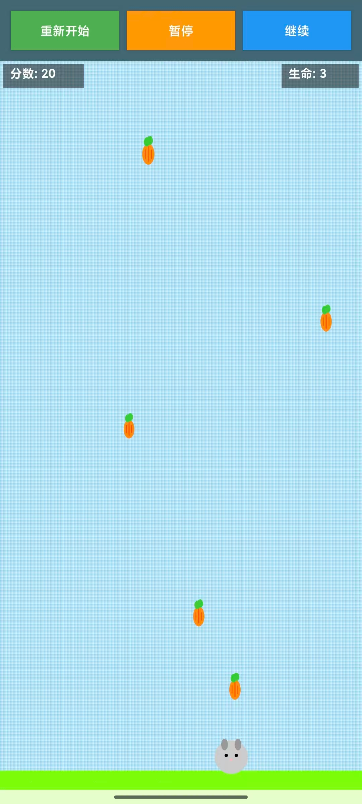
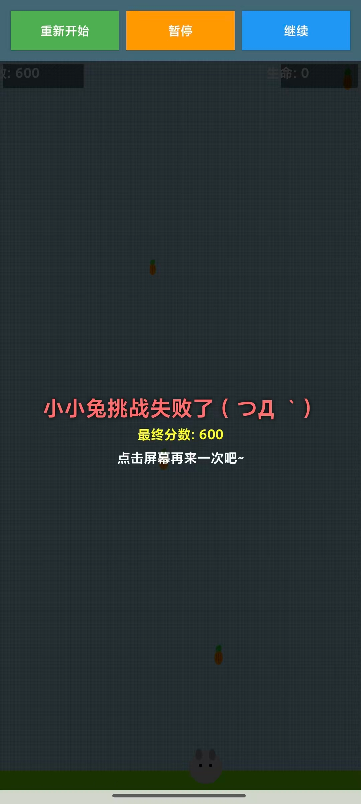

# RabbitGame

A simple Android game where a white rabbit catches falling carrots.

**Tech Stack**: Kotlin, Android Studio

## Screenshots

<table>
<tr>
<td align="center">

 
<em>Start Interface</em>

</td>
<td align="center">

 
<em>During Gameplay</em>

</td>
</tr>
</table>

## Quick Start
- Download APK and install on Android device
- Touch left/right to control the rabbit
- Catch carrots to score points!